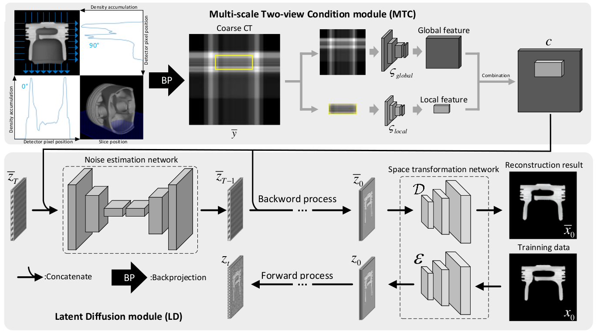

<!-- 关于本项目 -->
# TICT


## Environment
### Setup
Clone the repository and navigate into the directory:
```
$ git clone https://github.com/Xlab2024/TICT.git
$ cd TICT
```

### Install requirements
Create a conda environment with the file provided:
```
$ conda env create -f environment.yaml
```
## Download
### Dataset
- Convert the CT slices in your own dataset into 256x256 png images and store them in “./data/CT/your_dataset”, then write the file names into train.txt and val.txt.

### Pretrained Model
- For the pretrained weights VQ-F4 to train autoencoder. You can download from <a href="https://ommer-lab.com/files/latent-diffusion/vq-f4.zip">here</a>.
- For the pretrained weights LDM-VQ-4 to train noise estimation network. You can download from <a href="https://ommer-lab.com/files/latent-diffusion/sr_bsr.zip">here</a>.
## Training
First, train the autoencoder to obtain "last.ckpt". Next, with the "last.ckpt", train the remaining network components.
```
python main.py --base configs/autoencoder/VQ_f4_64x64x3.yaml -t --gpus 1
python main.py --base configs/latent-diffusion/config.yaml --gpus 1
```
During the training process, the generated results on the test set will be automatically evaluated and saved at regular intervals.

## Citation
If you use this code for your research, please cite our paper.

```bibtex
@ARTICLE{10711937,
  author={Hou, Lei and Liu, Jiahong and Li, Xuanheng and Sun, Yi},
  journal={IEEE Transactions on Instrumentation and Measurement}, 
  title={Two-View Industrial CT Reconstruction Based on a Multiscale Conditional Latent Diffusion Network}, 
  year={2024},
  volume={73},
  number={},
  pages={1-12},
  keywords={Computed tomography;Image reconstruction;Diffusion models;Feature extraction;Three-dimensional displays;Optimization;Noise;Shape;Generative adversarial networks;Reconstruction algorithms;Diffusion model;industrial defect detection;two-view computed tomography (CT) reconstruction},
  doi={10.1109/TIM.2024.3476543}}